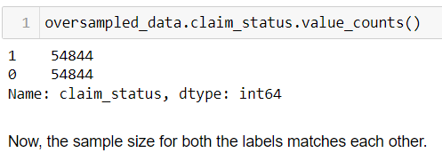
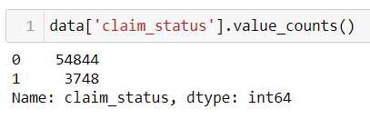
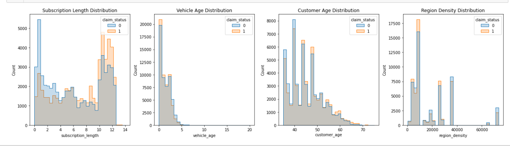
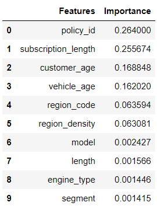
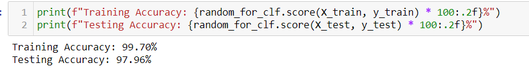
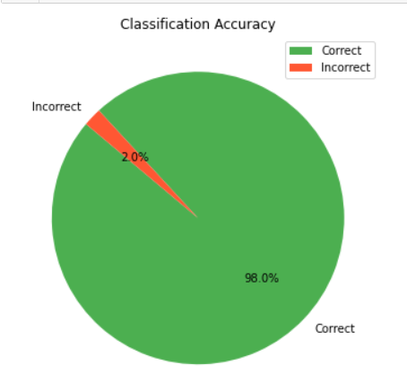

# Classification on Imbalanced Data
 This repository is dedicated to exploring various techniques and methodologies for dealing with imbalanced datasets in classification tasks. Imbalanced data is a common challenge in machine learning, where certain classes are underrepresented compared to others. This imbalance can lead to biased models that perform poorly on minority classes.

In real-world, when performing classification, the situation of having a imbalanced class is a very common situation. If we don't handle it and build the models to train on it, there will be bias and we will not be able to get an accurate and reliable outcome. 

The data is about an insurance claim frequency prediction. In total, there are 58,5892 samples and 41 features.

## 1. Count difference in class:
Below we can clearly see the difference in the count of the classes, this is an example of Imbalanced data:


There is a huge difference between the ones who have claimed (1) against the people who haven't claimed their insurance (0).

If this data is directly used to train the model, the predictions it will make will be biased. So, challenges like these needs to be addressed before building the model.

## 2. A heatmap to see the correlation:

To understand the relationship between the target class (claim_stauts) and independent features, we need to know how do they correlate. So, let's plot a heatmap that will show their relationship to better understand them.


It seems, subscription_length, vechicle_age, customer_age,and region_density are only correlated with the
claim_status. 

## 3. Distribution of numerical data:
Let's see these features and try to understand their distribution.


## 4. Distribution of categorical data:

There are wide varieties of region_code, but 'C8' seems to be the one which is dominant followed by 'C2', 'C5', and 'C3'.

In the segment distribution, there are few categories, with 'B2' segment being the most common, followed by 'A', and 'C2'.

In the fuel type, petrol is the one with highest count compared to CNG(Compressed Natural Gas) and Diesel.

#### By now we have completed our EDA (Expolratory Data Analysis), now we will start handling the class imbalance problem.


## 5. Handling Class Imbalance:

One of the ways to handle the class imbalance is to oversample the minority class i.e. we increase these minority
class such that it will matchup the counts of the majority class.

For this, we will use resample method from sklearn.utils

```python
from sklearn.utils import resample
```

After oversampling, now we will have a balanced dataset where the sample size of the labels 1 and 0 will be the same as below:


Before oversampling we had:



Now, the sample size for both the labels matches each other.

Let's visualize important features of this new over-sampled data . Let's plot the distribution of those 4 features that we did earlier:



The visualization of the distribution looks good and the data does seems like the original ones although we had oversampled them.

## 6. Feature Selection:
Now, since the label counts are matched and there is no any domination, we will now extract the features that are relevant to the target class i.e. claim_status and then build a model on those features.

Here we will be using Random Forest's feature_importances_ method to pull out top 10 features that is most relevant to the target class and later use them to build the model.

But our data is composed of different data types and one of them is object which means text or string and we cannot feed it directly to the model. It needs to be enocded in some numerical form. So, first we will be encoding text into numerical form. And same needs to be done to the integer or float columns because the values are quite different in magnitude because column with high magnitude will dominate the other columns whose value is small.


**Although we will be building Random Forest which is a tree based model and can handle data of different scales, its better to scale them.**

After training the Random Forest on the encoded data and using its feature_importances_ attribute, below are the top 10 features that now we will be using to build our main model.



These variables seem to have the greatest impact on the probability of an insurance claim. However, it's worth noting that the policy_id variable shows unusually high importance, which may not be logically connected to the prediction outcome. Therefore, we should ensure that the policy_id column is excluded during model training.


## 7. Building the model:

We have build the Random Forest classifier and used 9 features excluding policy_id and got the accuracy on training and testing data as below:


The pie-chart below shows the model's performance on <b>Actual Data Vs Predicted Data:</b>


