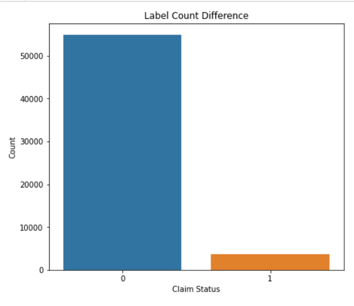
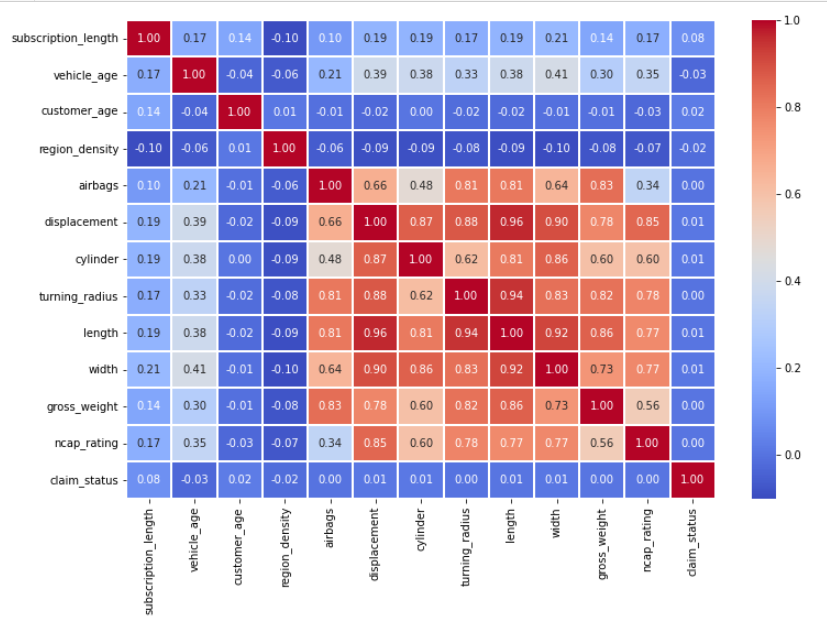
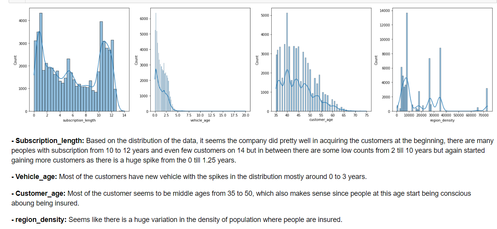
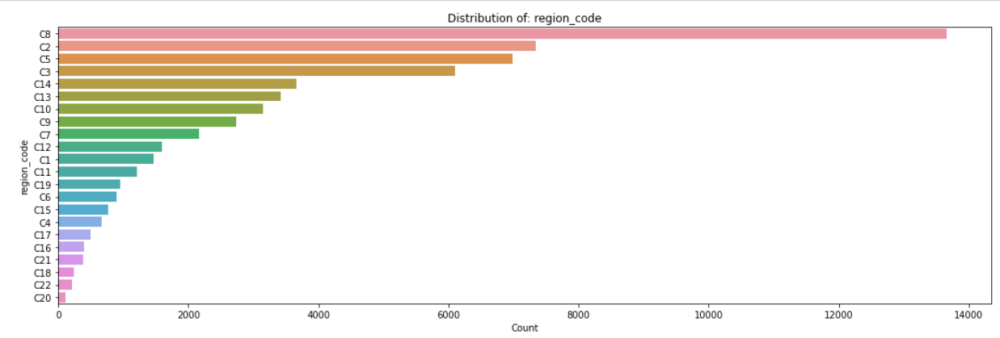
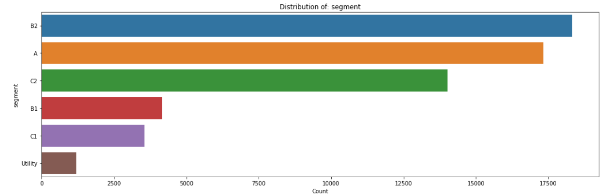
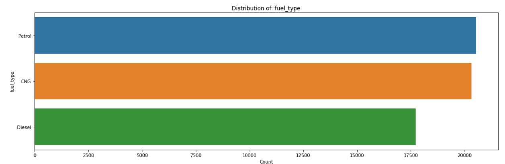

# Classification on Imbalanced Data
 This repository is dedicated to exploring various techniques and methodologies for dealing with imbalanced datasets in classification tasks. Imbalanced data is a common challenge in machine learning, where certain classes are underrepresented compared to others. This imbalance can lead to biased models that perform poorly on minority classes.

In real-world, when performing classification, the situation of having a imbalanced class is a very common situation. If we don't handle it and build the models to train on it, there will be bias and we will not be able to get an accurate and reliable outcome. 

The data is about an insurance claim frequency prediction. In total, there are 58,5892 samples and 41 features.

## Count difference in class:
Below we can clearly see the difference in the count of the classes, this is an example of Imbalanced data:

There is a huge difference between the ones who have claimed (1) against the people who haven't claimed their insurance (0).

If this data is directly used to train the model, the predictions it will make will be biased. So, challenges like these needs to be addressed before building the model.

## A heatmap to see the correlation:

To understand the relationship between the target class (claim_stauts) and independent features, we need to know how do they correlate. So, let's plot a heatmap that will show their relationship to better understand them.

It seems, subscription_length, vechicle_age, customer_age,and region_density are only correlated with the
claim_status. 

## Distribution of numerical data:
Let's see these features and try to understand their distribution.

## Distribution of categorical data:

There are wide varieties of region_code, but 'C8' seems to be the one which is dominant followed by 'C2', 'C5', and 'C3'.

In the segment distribution, there are few categories, with 'B2' segment being the most common, followed by 'A', and 'C2'.

In the fuel type, petrol is the one with highest count compared to CNG(Compressed Natural Gas) and Diesel.

#### By now we have completed our EDA (Expolratory Data Analysis), now we will start handling the class imbalance problem.
